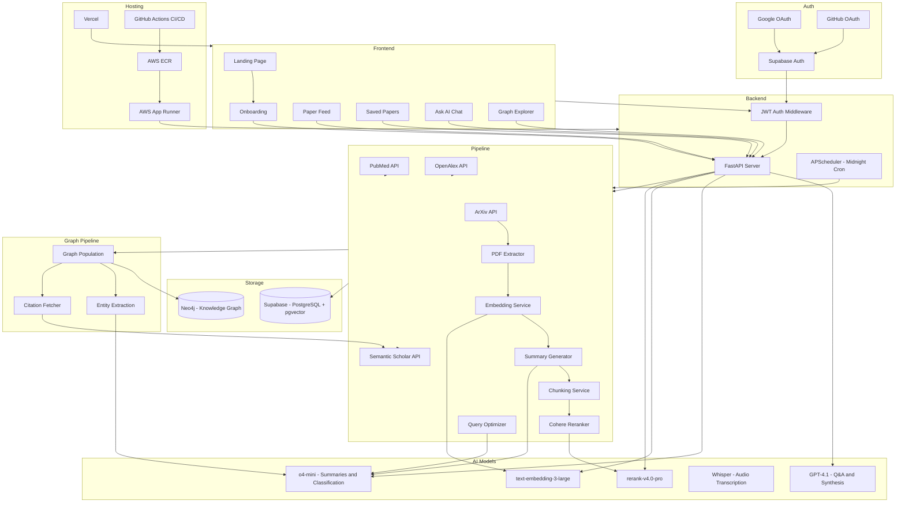
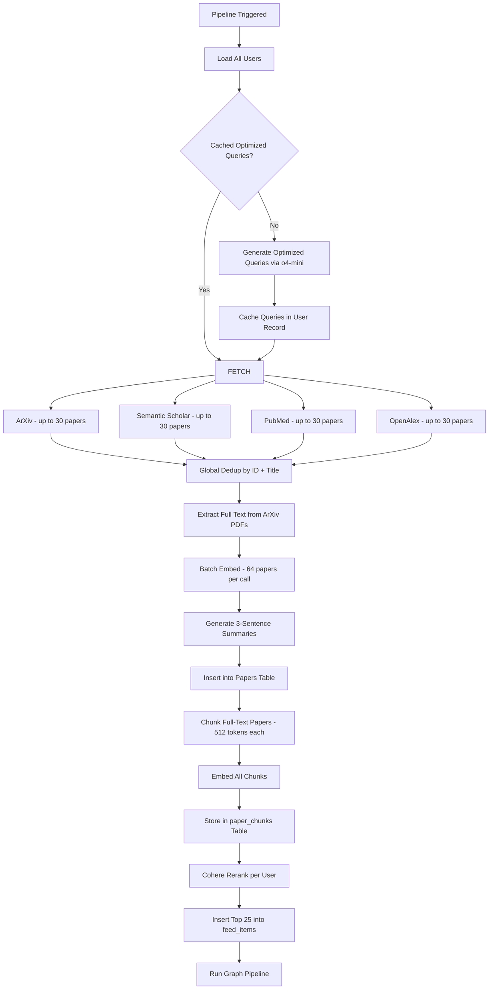
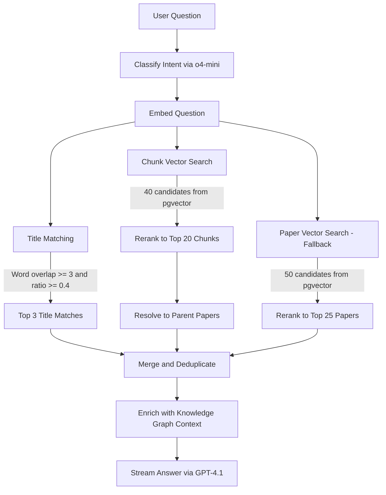
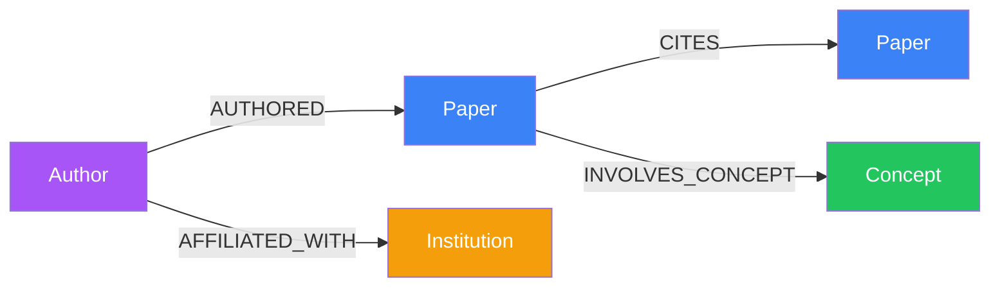
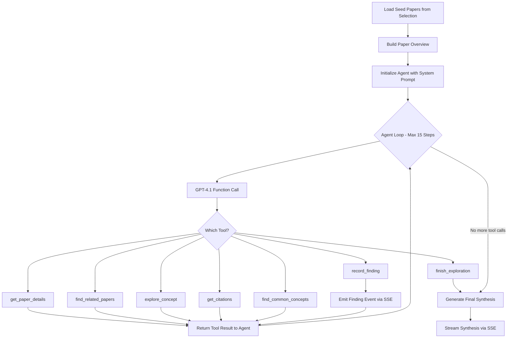
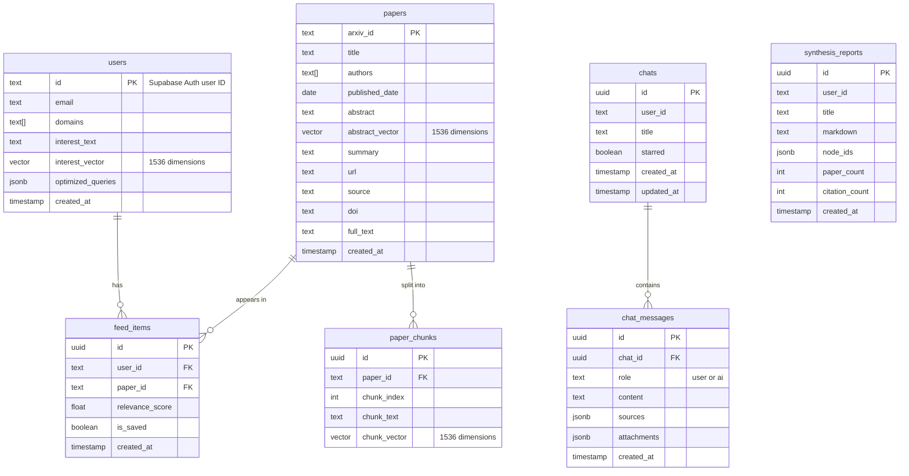

# PaperPulse


An AI-powered academic research platform that aggregates papers from four major sources, builds a knowledge graph of research connections, and lets you ask questions about your personalized paper feed using retrieval-augmented generation.

---

## Table of Contents

**For Everyone**

- [What Is PaperPulse](#what-is-paperpulse)
- [Demo](#demo)
- [Key Features](#key-features)
- [How It Works](#how-it-works)

**For Developers**

- [Architecture Overview](#architecture-overview)
- [System Design](#system-design)
  - [Data Ingestion Pipeline](#data-ingestion-pipeline)
  - [Paper Processing](#paper-processing)
  - [Retrieval and Ranking](#retrieval-and-ranking)
  - [Knowledge Graph](#knowledge-graph)
  - [AI Question Answering](#ai-question-answering)
  - [Agent-Based Graph Traversal](#agent-based-graph-traversal)
- [Tech Stack](#tech-stack)
- [Authentication and Security](#authentication-and-security)
- [Deployment](#deployment)
- [Database Schema](#database-schema)
- [API Reference](#api-reference)
- [Frontend Pages](#frontend-pages)
- [Getting Started](#getting-started)
- [Environment Variables](#environment-variables)
- [Project Structure](#project-structure)

---

## What Is PaperPulse

Keeping up with academic research is hard. Thousands of papers are published every day across ArXiv, PubMed, Semantic Scholar, and OpenAlex. Reading even a fraction of them takes hours.

PaperPulse solves this by acting as a personal research assistant. You tell it what topics you care about, and it does the rest:

- **Finds relevant papers** from four major academic databases every day
- **Ranks them** using neural reranking so the most important papers appear first
- **Summarizes each paper** in three plain-English sentences
- **Builds a knowledge graph** that maps how papers, authors, concepts, and institutions connect to each other
- **Answers your questions** about the papers using the actual content, not just titles and abstracts
- **Generates literature reviews** from selected papers, complete with citation diagrams

You sign up, pick your research areas, describe your interests in a sentence or two, and PaperPulse starts curating a daily feed tailored to you.

---

## Demo

<!-- Replace these placeholders with actual screenshots and video -->

### Video Walkthrough

<!-- VIDEO_PLACEHOLDER: Add a link to your demo video here -->
<!-- Example: [](https://youtu.be/VIDEO_ID) -->

`[Video walkthrough coming soon]`

### Screenshots

| Feed                                                     | Ask AI                                                 | Knowledge Graph                                            |
| -------------------------------------------------------- | ------------------------------------------------------ | ---------------------------------------------------------- |
|  |  |  |

| Onboarding                                                           | Saved Papers                                               | Literature Review                                            |
| -------------------------------------------------------------------- | ---------------------------------------------------------- | ------------------------------------------------------------ |
|  |  |  |

---

## Key Features

### Daily Personalized Feed

Papers are fetched from ArXiv, Semantic Scholar, PubMed, and OpenAlex based on your selected domains and interests. Each paper is ranked by relevance to your profile using Cohere neural reranking, and the top 25 appear in your feed grouped by date.

### AI-Generated Summaries

Every paper gets a three-sentence summary written by an AI reasoning model. These summaries explain what the paper does, why it matters, and what the key results are, without requiring you to read the full paper.

### Ask AI with Full Paper Context

Ask questions about any paper or topic in your feed. The system retrieves relevant paper content using hybrid search across titles, chunks, and full papers, enriches it with knowledge graph context, and streams a detailed answer with inline citations.

### Multimodal Input

Upload images, PDFs, Word documents, audio files, or video alongside your questions. The system extracts text or transcribes media and includes it in the AI response context.

### Knowledge Graph Explorer

An interactive force-directed graph visualization that shows how papers, authors, concepts, and institutions relate to each other. Click any node to see its connections, search across the graph, filter by node or edge type, and detect research clusters automatically.

### Literature Synthesis

Select papers from the knowledge graph and generate structured literature reviews. Three modes are available:

- **Quick Review** produces a concise overview with a Mermaid citation diagram
- **Publication Review** generates a multi-section academic review with BibTeX references
- **Deep Analysis** uses an autonomous AI agent that explores the graph iteratively, discovers themes, and writes a comprehensive synthesis

### Persistent Chat History

All conversations are saved with full message history, file attachments, and source citations. Chats can be starred, renamed, searched, and resumed at any time.

---

## How It Works

For non-technical readers, here is the simplified flow:

1. **You sign up** with Google, GitHub, or email and pick topics like "Computer Science" or "Biology" and describe what specifically interests you
2. **PaperPulse optimizes your interests** into precise search queries using AI
3. **Every day at midnight**, the system searches four academic databases for papers matching your interests
4. **Each paper is processed**: the full PDF text is extracted, an embedding vector is created for semantic search, and a summary is generated
5. **Papers are ranked** by how relevant they are to your specific interests, and the top 25 land in your daily feed
6. **A knowledge graph is built** connecting papers to their authors, key concepts, institutions, and citation relationships
7. **When you ask a question**, the system finds the most relevant paper sections, adds knowledge graph context, and generates a detailed answer with citations

---

## Architecture Overview



---

## System Design

### Data Ingestion Pipeline

The daily pipeline runs automatically at midnight via APScheduler and can also be triggered manually. It processes papers on a per-user basis.



**Query optimization** runs once when a user first onboards, then refreshes automatically every 7 days. The system takes the user's free-text interests and selected domains, and uses o4-mini to generate 3-5 focused search queries, 6-10 technical keywords, and 2-5 specific ArXiv sub-categories. These optimized queries are cached in the user record with a `generated_at` timestamp and reused on subsequent daily pipeline runs until the 7-day refresh window expires.

> **Daily vs. 7-day**: The pipeline itself runs **every day at midnight** (UTC), fetching and ranking new papers for every user. The 7-day cycle only controls how often the **search queries** are regenerated — the actual paper fetching, embedding, summarization, and ranking happen every single night.

**Paper source details**:

| Source           | API             | Rate Limit            | Batch Size         | Daily Lookback | Bootstrap Lookback |
| ---------------- | --------------- | --------------------- | ------------------ | -------------- | ------------------ |
| ArXiv            | Atom XML feed   | 3s between requests   | 100 per call       | 3 days         | 30 days            |
| Semantic Scholar | REST JSON       | 1s between requests   | 100 per call       | 3 days         | 30 days            |
| PubMed           | E-utilities XML | 0.35s with API key    | 50 per fetch batch | 7 days         | 30 days            |
| OpenAlex         | REST JSON       | 0.2s between requests | 50 per page        | 3 days         | 30 days            |

**Feed exclusion**: Before reranking, the pipeline queries each user's existing `feed_items` and removes any papers they have already received, ensuring only new papers enter the feed.

**Deduplication** prefers ArXiv versions when the same paper appears from multiple sources. Papers are matched by ArXiv ID first, then by normalized title similarity.

### Paper Processing

Each paper goes through several processing stages after fetching:

**Full-text extraction** downloads the PDF from ArXiv and extracts text using PyMuPDF. The extracted text is cleaned by removing null bytes, collapsing whitespace, stripping page numbers, and fixing hyphenation artifacts. Output is capped at 120,000 characters, which is roughly 30,000 tokens.

**Embedding** uses OpenAI text-embedding-3-large at 1536 dimensions. Papers are embedded in batches of 64. The embedding is generated from the paper abstract and stored as a pgvector column for semantic search.

**Summarization** uses o4-mini with reasoning effort set to "low" for cost efficiency. Each paper gets a three-sentence summary explaining the problem, approach, and findings.

**Chunking** splits full-text papers into overlapping segments for sub-document retrieval:

| Parameter              | Value       |
| ---------------------- | ----------- |
| Target chunk size      | 512 tokens  |
| Overlap between chunks | 50 tokens   |
| Minimum chunk size     | 50 tokens   |
| Tokenizer              | cl100k_base |

The chunking algorithm splits on paragraph boundaries first, then falls back to sentence-level splitting for oversized paragraphs. Each chunk is prefixed with the paper title to give the embedding model document-level context.

### Retrieval and Ranking

When a user asks a question, a three-stage hybrid retrieval pipeline finds relevant content:



**Stage 1 - Title matching** does word-overlap comparison between the question and all paper titles in the user's feed. A match requires at least 3 overlapping non-stop-words and a Jaccard ratio of 0.4 or higher. The top 3 matches are returned.

**Stage 2 - Chunk-level vector search** calls a Supabase RPC function that performs cosine similarity search across the paper_chunks table. It returns 40 candidate chunks, which are then reranked by Cohere to the top 20. The parent papers are resolved from the matching chunks.

**Stage 3 - Paper-level fallback** activates if chunk search returns fewer than 3 results. It searches the papers table directly using abstract embeddings, returning 50 candidates reranked to the top 25.

Results from all three stages are merged with title matches taking priority, deduplicated by paper ID.

**Knowledge graph enrichment** fetches the graph neighborhood for all retrieved papers, including co-authors, related concepts, citation links, and institutional affiliations. This context is prepended to the LLM prompt so the model can reference structural relationships.

**Intent classification** uses o4-mini to categorize the question as "retrieval" requiring paper lookup, "follow_up" continuing from conversation history, or "general" needing no paper context. This determines whether the full retrieval pipeline runs.

### Knowledge Graph

The knowledge graph is stored in Neo4j and captures structural relationships between research entities.



**Node types and properties**:

| Node        | Properties                                   |
| ----------- | -------------------------------------------- |
| Paper       | arxiv_id, title, published_date, source, url |
| Author      | name, name_lower                             |
| Concept     | name, name_lower, category                   |
| Institution | name, name_lower                             |

Concept categories are: method, dataset, theory, task, and technique.

**Edge types**:

| Edge             | Meaning                         |
| ---------------- | ------------------------------- |
| CITES            | Paper A references Paper B      |
| AUTHORED         | Author wrote Paper              |
| INVOLVES_CONCEPT | Paper uses or discusses Concept |
| AFFILIATED_WITH  | Author belongs to Institution   |

**Graph population pipeline**:

1. **Paper nodes** are batch-upserted using MERGE on arxiv_id
2. **Author relationships** are created from paper metadata
3. **Concepts** are extracted by o4-mini from each paper's title and abstract, producing 3-10 tagged concepts per paper
4. **Citations** are fetched from the Semantic Scholar API for up to 30 papers per run, creating CITES edges
5. **Institutions** are fetched from the OpenAlex API using DOI lookups for up to 20 papers per run

**Cluster detection** uses connected-component analysis. Two papers are considered connected if they share 2 or more concepts or have a direct citation link. The algorithm runs BFS to find all connected components and labels each cluster by its top 3 most frequent concepts.

**Constraints and indexes**:

- Uniqueness constraints on Paper.arxiv_id, Author.name_lower, Concept.name_lower, Institution.name_lower
- Full-text indexes on Paper.title and Concept.name for search

### AI Question Answering

The Q&A system supports text-only and multimodal queries with SSE streaming.

**Models and configuration**:

| Setting            | Value            |
| ------------------ | ---------------- |
| Q&A model          | GPT-4.1          |
| Temperature        | 0.4              |
| Max output tokens  | 16,384           |
| Max context window | 32,000 tokens    |
| History window     | Last 10 messages |
| Message truncation | 3,000 characters |

**Context budget allocation** divides the available token budget evenly across retrieved papers, with a minimum of 800 tokens per paper. If a paper's full text exceeds its budget, it is truncated at the token level by encoding, slicing, and decoding. Papers with fewer than 200 remaining tokens after title allocation are dropped.

**Multimodal processing**:

| Input Type | Processing                                                     |
| ---------- | -------------------------------------------------------------- |
| Images     | Base64-encoded and sent to GPT-4.1 vision                      |
| PDFs       | Text extracted via PyMuPDF                                     |
| Word docs  | Text extracted via python-docx                                 |
| Audio      | Transcribed via Whisper                                        |
| Video      | Audio track extracted via ffmpeg, then transcribed via Whisper |
| Text files | Read directly as UTF-8                                         |

Maximum file size is 25 MB per upload.

**SSE streaming** sends five event types during a response:

| Event   | Payload                          | Timing                    |
| ------- | -------------------------------- | ------------------------- |
| stage   | Current processing step name     | As each stage starts      |
| sources | Retrieved paper metadata         | After retrieval completes |
| token   | Single token of the LLM response | During generation         |
| done    | Final complete response text     | After generation finishes |
| error   | Error message                    | On failure                |

### Agent-Based Graph Traversal

The Deep Analysis mode uses an autonomous agent that iteratively explores the knowledge graph to discover research themes, gaps, and connections before writing a synthesis.



The agent has access to seven tools that query the Neo4j knowledge graph. It starts with the user-selected papers, explores outward by following citations, related papers, and shared concepts, and records findings along the way. Each finding is categorized as a theme, gap, method, trend, connection, or contradiction.

The agent runs with temperature 0.2 for structured tool-calling decisions and switches to temperature 0.3 with a 6,144 token budget for the final synthesis.

---

## Tech Stack

### Backend

| Technology          | Role                                  |
| ------------------- | ------------------------------------- |
| Python 3.11+        | Runtime                               |
| FastAPI             | REST API framework                    |
| Uvicorn             | ASGI server                           |
| APScheduler         | Scheduled pipeline execution          |
| Pydantic            | Request and response validation       |
| Supabase Python SDK | PostgreSQL and pgvector client        |
| Neo4j Python Driver | Knowledge graph client                |
| OpenAI Python SDK   | GPT-4.1, o4-mini, embeddings, Whisper |
| Cohere Python SDK   | Neural reranking                      |
| PyMuPDF             | PDF text extraction                   |
| python-docx         | Word document parsing                 |
| tiktoken            | Token counting                        |
| httpx               | Async HTTP client                     |
| python-dotenv       | Environment configuration             |
| tenacity            | Retry logic for API calls             |

### Frontend

| Technology                   | Role                               |
| ---------------------------- | ---------------------------------- |
| Next.js 16                   | React framework with App Router    |
| React 19                     | UI library                         |
| TypeScript 5                 | Type safety                        |
| Tailwind CSS 4               | Utility-first styling              |
| shadcn/ui                    | Reusable UI components             |
| Supabase Auth                | Authentication and user management |
| react-force-graph-2d         | Force-directed graph visualization |
| react-markdown               | Markdown rendering                 |
| rehype-katex and remark-math | LaTeX math rendering               |
| Mermaid                      | Diagram generation                 |
| Lucide React                 | Icon library                       |

### Infrastructure

| Technology     | Role                                        |
| -------------- | ------------------------------------------- |
| AWS App Runner | Managed backend hosting                     |
| AWS ECR        | Docker container registry                   |
| Vercel         | Frontend hosting and edge network           |
| GitHub Actions | CI/CD pipeline for backend deployment       |
| Docker         | Backend containerization                    |
| Supabase       | Managed PostgreSQL with pgvector extension  |
| Neo4j Aura     | Managed graph database                      |
| Supabase Auth  | Authentication with Google and GitHub OAuth |

### AI Models

| Model                  | Provider | Purpose                                                                                    |
| ---------------------- | -------- | ------------------------------------------------------------------------------------------ |
| GPT-4.1                | OpenAI   | Q&A answers, multimodal vision, literature synthesis, publication reviews, agent traversal |
| o4-mini                | OpenAI   | Paper summaries, intent classification, chat titles, entity extraction, query optimization |
| text-embedding-3-large | OpenAI   | 1536-dimension vector embeddings for papers, chunks, and user interests                    |
| Whisper                | OpenAI   | Audio and video transcription                                                              |
| rerank-v4.0-pro        | Cohere   | Neural reranking with 32K token context per document                                       |

---

## Authentication and Security

### Backend Security

All backend API routes are protected by JWT-based authentication via Supabase Auth:

- **`get_current_user()`** — Extracts the `Authorization: Bearer <token>` header, verifies the JWT with Supabase, and returns the authenticated user. Applied as a dependency on all routers.
- **`require_same_user()`** — Ensures the authenticated user can only access their own data (feed, chats, reports). Used on user-scoped endpoints.
- **`require_admin()`** — Protects admin-only endpoints (pipeline trigger, graph population) with an `X-Admin-Key` header. If `ADMIN_API_KEY` is not set, admin endpoints are unrestricted (dev mode).

### Frontend Security

- **`authFetch()`** — A wrapper around `fetch()` in [lib/api.ts](frontend/lib/api.ts) that automatically attaches the Supabase session JWT to every API request.
- **`proxy.ts`** — Next.js 16 middleware proxy that calls `updateSession()` on every request to refresh the Supabase session cookie.
- **Auth guards** — All protected pages (`/feed`, `/saved`, `/ask`, `/graph`, `/onboarding`) check `useAuth()` and redirect unauthenticated users to the landing page.
- **OAuth callback** — [app/auth/callback/route.ts](frontend/app/auth/callback/route.ts) handles the OAuth redirect after Google or GitHub sign-in, exchanging the code for a session.

### OAuth Providers

| Provider | Scopes         |
| -------- | -------------- |
| Google   | email, profile |
| GitHub   | user:email     |

Email/password sign-up is also supported as a fallback.

---

## Deployment

### Architecture

```
┌──────────────┐     ┌──────────────────┐     ┌──────────────────┐
│   GitHub     │────>│   GitHub Actions  │────>│    AWS ECR       │
│   (push to   │     │   (build & push   │     │  (Docker image   │
│    main)     │     │    Docker image)  │     │   registry)      │
└──────────────┘     └──────────────────┘     └────────┬─────────┘
                                                       │
                                                       v
┌──────────────┐                              ┌──────────────────┐
│   Vercel     │                              │  AWS App Runner  │
│  (Frontend)  │─────────── API calls ───────>│   (Backend)      │
└──────────────┘                              └──────────────────┘
       │                                               │
       v                                               v
┌──────────────┐                              ┌──────────────────┐
│ Supabase Auth│                              │  Supabase DB     │
│ (OAuth +     │                              │  (PostgreSQL +   │
│  sessions)   │                              │   pgvector)      │
└──────────────┘                              └──────────────────┘
                                                       │
                                                       v
                                              ┌──────────────────┐
                                              │   Neo4j Aura     │
                                              │ (Knowledge Graph)│
                                              └──────────────────┘
```

### Backend (AWS)

- **Container Registry**: AWS ECR (`paper-pulse-api`)
- **Hosting**: AWS App Runner auto-deploys from the ECR image
- **CI/CD**: GitHub Actions workflow ([deploy-backend.yml](.github/workflows/deploy-backend.yml)) triggers on pushes to `main` that touch `backend/**`, builds the Docker image, and pushes to ECR
- **Dockerfile**: Multi-stage build in `backend/Dockerfile`

### Frontend (Vercel)

- Connected directly to the GitHub repository
- Auto-deploys on push to `main`
- Environment variables configured in the Vercel dashboard

### Database

- **Supabase**: Managed PostgreSQL with pgvector extension, hosted by Supabase
- **Neo4j Aura**: Managed graph database with automatic retry logic (3 attempts, exponential backoff) for transient connection failures

---

## Database Schema

### Supabase Tables



### Supabase RPC Functions

| Function           | Purpose                                                                   |
| ------------------ | ------------------------------------------------------------------------- |
| match_paper_chunks | Cosine similarity search on chunk vectors, filtered by user feed          |
| match_user_papers  | Cosine similarity search on paper abstract vectors, filtered by user feed |

### Neo4j Graph Schema

| Constraint             | Target |
| ---------------------- | ------ |
| Paper.arxiv_id         | Unique |
| Author.name_lower      | Unique |
| Concept.name_lower     | Unique |
| Institution.name_lower | Unique |

| Full-Text Index | Field        |
| --------------- | ------------ |
| paper_title_ft  | Paper.title  |
| concept_name_ft | Concept.name |

---

## API Reference

> All endpoints require a valid `Authorization: Bearer <token>` header from Supabase Auth, except where noted.

### Users

| Method | Path             | Description                                                         |
| ------ | ---------------- | ------------------------------------------------------------------- |
| POST   | /users/          | Create user from onboarding with domain selection and interest text |
| GET    | /users/{user_id} | Get user profile                                                    |

### Feed

| Method | Path                  | Description                                        |
| ------ | --------------------- | -------------------------------------------------- |
| GET    | /feed/{user_id}       | Get daily paper feed ordered by date and relevance |
| GET    | /feed/{user_id}/saved | Get saved papers                                   |
| PATCH  | /feed/{feed_item_id}  | Toggle save status                                 |

### Papers

| Method | Path               | Description                                |
| ------ | ------------------ | ------------------------------------------ |
| GET    | /papers/{arxiv_id} | Get full paper metadata, summary, and text |

### Ask

| Method | Path                   | Description                             |
| ------ | ---------------------- | --------------------------------------- |
| POST   | /ask/                  | Text-only Q&A with conversation history |
| POST   | /ask/multimodal        | Q&A with file uploads                   |
| POST   | /ask/stream            | SSE streaming text-only Q&A             |
| POST   | /ask/stream/multimodal | SSE streaming multimodal Q&A            |

### Chats

| Method | Path                      | Description                                      |
| ------ | ------------------------- | ------------------------------------------------ |
| GET    | /chats/                   | List all chats sorted by starred then updated    |
| GET    | /chats/search             | Full-text search across chat titles and messages |
| POST   | /chats/                   | Create new chat                                  |
| GET    | /chats/{chat_id}          | Get chat with all messages                       |
| PATCH  | /chats/{chat_id}          | Update title or starred status                   |
| DELETE | /chats/{chat_id}          | Delete chat and all messages                     |
| POST   | /chats/{chat_id}/messages | Save a message with auto-title generation        |

### Knowledge Graph

| Method | Path                              | Description                                       |
| ------ | --------------------------------- | ------------------------------------------------- |
| GET    | /graph/explore                    | Full graph data for the explorer                  |
| GET    | /graph/stats                      | Node and edge counts                              |
| GET    | /graph/search                     | Full-text search across papers, authors, concepts |
| GET    | /graph/clusters                   | Auto-detected paper clusters                      |
| GET    | /graph/paper/{arxiv_id}           | Paper neighborhood                                |
| GET    | /graph/paper/{arxiv_id}/related   | Related papers by shared concepts and citations   |
| GET    | /graph/paper/{arxiv_id}/citations | Citation network up to 3 hops                     |
| GET    | /graph/author/{name}              | Co-author network                                 |
| GET    | /graph/concept/{name}             | Papers involving a concept                        |
| GET    | /graph/node/{node_id}             | Node detail with neighborhood                     |
| POST   | /graph/synthesize                 | Quick literature review with Mermaid diagram      |
| POST   | /graph/synthesize-publication     | Publication-ready review with BibTeX              |
| POST   | /graph/agent-synthesize           | SSE-streamed agent traversal and synthesis        |
| GET    | /graph/reports                    | List saved reports                                |
| POST   | /graph/reports                    | Save a report                                     |
| DELETE | /graph/reports/{report_id}        | Delete a report                                   |
| POST   | /graph/populate                   | Trigger graph population                          |
| GET    | /graph/populate/status            | Check graph population status                     |

### Pipeline

| Method | Path                | Description                                           |
| ------ | ------------------- | ----------------------------------------------------- |
| POST   | /pipeline/run       | Manually trigger the daily pipeline (admin only)      |
| GET    | /pipeline/status    | Check pipeline running status (admin only)            |
| POST   | /pipeline/bootstrap | Run bootstrap pipeline for a single user (admin only) |

---

## Frontend Pages

### Landing Page

Centered hero with sign-in and sign-up buttons for unauthenticated users, and a "Go to my Feed" link for signed-in users. Uses Supabase Auth for session detection.

### Onboarding

Domain selection grid with 28 research areas organized into five categories: Core Sciences, Life and Health Sciences, Engineering and Applied, Social Sciences and Humanities, and Physics Specializations. Includes a free-text interest description field. On submit, the backend generates an interest embedding and optimized search queries.

### Paper Feed

Date-grouped paper cards with a date navigation sidebar. Each card shows the title, authors, source badge, relevance score, AI summary, and action buttons for saving and exploring with AI. Uses IntersectionObserver for scroll-based date tracking.

### Saved Papers

Filtered view of bookmarked papers with search functionality. Same card layout as the main feed with an unsave toggle.

### Ask AI

Full chat interface with a sidebar listing all conversations. Features include persistent chat sessions, file attachments with preview, voice recording via the MediaRecorder API, SSE streaming responses with stage indicators, markdown rendering with KaTeX math and GFM tables, and related paper suggestions from the knowledge graph.

### Knowledge Graph Explorer

Interactive force-directed graph powered by react-force-graph-2d. Papers are blue, authors are purple, concepts are green, and institutions are amber. Features include node hover highlighting with neighbor emphasis, node and edge type filtering, full-text search, click-to-detail panels, auto-detected cluster visualization with click-to-zoom, three synthesis modes, Mermaid diagram rendering, report saving and loading, PNG export, and a table of contents for long reports.

---

## Getting Started

### Prerequisites

- Python 3.11 or later
- Node.js 18 or later
- A Supabase project with pgvector enabled
- A Neo4j Aura instance or local Neo4j database
- API keys for OpenAI and Cohere

### Backend Setup

```bash
cd backend
python -m venv venv
source venv/bin/activate
pip install -r requirements.txt
cp .env.example .env
```

Edit the .env file with your credentials, then start the server:

```bash
python run.py
```

The API will be available at http://localhost:8000.

### Frontend Setup

```bash
cd frontend
npm install
cp .env.example .env.local
```

Edit .env.local with your Supabase URL and anon key, then start the dev server:

```bash
npm run dev
```

The app will be available at http://localhost:3000.

### Production Deployment

**Backend (AWS)**:

1. Push to `main` with changes in `backend/` — GitHub Actions automatically builds the Docker image and pushes it to AWS ECR
2. AWS App Runner detects the new image and redeploys automatically
3. Set all backend environment variables in the App Runner service configuration

**Frontend (Vercel)**:

1. Connect the repository to Vercel
2. Set `NEXT_PUBLIC_SUPABASE_URL`, `NEXT_PUBLIC_SUPABASE_ANON_KEY`, and `NEXT_PUBLIC_API_URL` in the Vercel dashboard
3. Pushes to `main` auto-deploy

**Auth**:

1. Configure Google and GitHub OAuth providers in the Supabase dashboard
2. Set the redirect URL to `https://<your-frontend-domain>/auth/callback`

---

## Environment Variables

### Backend

| Variable                 | Required | Description                                              |
| ------------------------ | -------- | -------------------------------------------------------- |
| OPENAI_API_KEY           | Yes      | OpenAI API key for GPT-4.1, o4-mini, embeddings, Whisper |
| COHERE_API_KEY           | Yes      | Cohere API key for rerank-v4.0-pro                       |
| SUPABASE_URL             | Yes      | Supabase project URL                                     |
| SUPABASE_KEY             | Yes      | Supabase service role key                                |
| NEO4J_URI                | Yes      | Neo4j connection URI                                     |
| NEO4J_USERNAME           | Yes      | Neo4j username                                           |
| NEO4J_PASSWORD           | Yes      | Neo4j password                                           |
| CORS_ORIGIN              | No       | Frontend origin URL, defaults to http://localhost:3000   |
| SEMANTIC_SCHOLAR_API_KEY | No       | Semantic Scholar API key for higher rate limits          |
| NCBI_API_KEY             | No       | PubMed API key for higher rate limits                    |
| OPENALEX_MAILTO          | No       | Email for OpenAlex polite pool                           |
| ADMIN_API_KEY            | Prod     | Shared secret for admin-only endpoints                   |

### Frontend

| Variable                      | Required | Description                                        |
| ----------------------------- | -------- | -------------------------------------------------- |
| NEXT_PUBLIC_SUPABASE_URL      | Yes      | Supabase project URL                               |
| NEXT_PUBLIC_SUPABASE_ANON_KEY | Yes      | Supabase anonymous (public) key                    |
| NEXT_PUBLIC_API_URL           | Yes      | Backend API URL, defaults to http://localhost:8000 |

---

## Project Structure

```
paper-pulse/
    .github/
        workflows/
            deploy-backend.yml              CI/CD: build and push Docker image to ECR
    backend/
        run.py                              Server entry point
        requirements.txt                    Python dependencies
        Dockerfile                          Container build for AWS deployment
        app/
            main.py                         FastAPI app with lifespan and scheduler
            database.py                     Supabase client initialization
            models.py                       Pydantic request and response models
            auth.py                         JWT auth, ownership checks, admin gate
            routers/
                users.py                    User registration and profiles
                feed.py                     Paper feed and bookmarks
                papers.py                   Single paper lookup
                ask.py                      Q&A with hybrid retrieval and SSE streaming
                chats.py                    Chat CRUD and message persistence
                graph.py                    Knowledge graph queries and synthesis
                pipeline.py                Manual pipeline trigger and bootstrap
            services/
                openai_service.py           GPT-4.1, o4-mini, embeddings, Whisper calls
                pipeline_service.py         Daily ingestion pipeline orchestration
                neo4j_service.py            Neo4j driver, schema, queries, clustering
                agent_service.py            Autonomous graph traversal agent
                graph_pipeline_service.py   Graph population from paper data
                arxiv_service.py            ArXiv API integration
                semantic_scholar_service.py Semantic Scholar API integration
                pubmed_service.py           PubMed E-utilities API integration
                openalex_service.py         OpenAlex API integration
                citation_service.py         Citation fetching from S2 and OpenAlex
                chunking_service.py         Paper text chunking for vector search
                pdf_service.py              PDF download and text extraction
                rerank_service.py           Cohere neural reranking
                query_optimizer.py          LLM-based search query optimization
                entity_extraction_service.py Concept and affiliation extraction
                file_processor.py           Multimodal file processing
    frontend/
        package.json                        Node dependencies
        next.config.ts                      Next.js configuration
        proxy.ts                            Supabase session refresh middleware
        app/
            layout.tsx                      Root layout with Supabase AuthProvider
            page.tsx                        Landing page
            globals.css                     Global styles
            auth/
                callback/route.ts           OAuth callback handler
            onboarding/page.tsx             Domain selection and interest input
            feed/page.tsx                   Daily paper feed with date grouping
            saved/page.tsx                  Saved papers view
            ask/page.tsx                    AI chat interface
            graph/page.tsx                  Knowledge graph explorer
            sign-in/page.tsx                Email and password sign-in
            sign-up/page.tsx                Email and password sign-up
        components/
            RelatedPapers.tsx               Related paper suggestions
            mermaid-renderer.tsx            Mermaid diagram renderer
            auth-provider.tsx               Supabase Auth context and useAuth hook
            user-menu.tsx                   User avatar dropdown with sign-out
            ui/                             shadcn/ui primitives
        utils/
            supabase/
                client.ts                   Browser Supabase client
                server.ts                   Server-side Supabase client
                middleware.ts               Session refresh middleware helper
        lib/
            api.ts                          authFetch wrapper with JWT injection
            utils.ts                        Tailwind class merge utility
```
