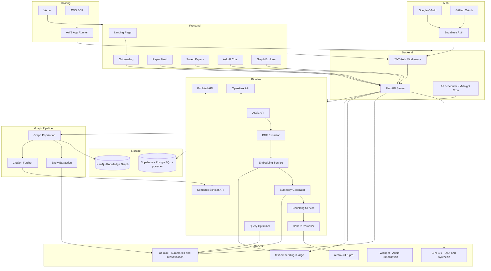
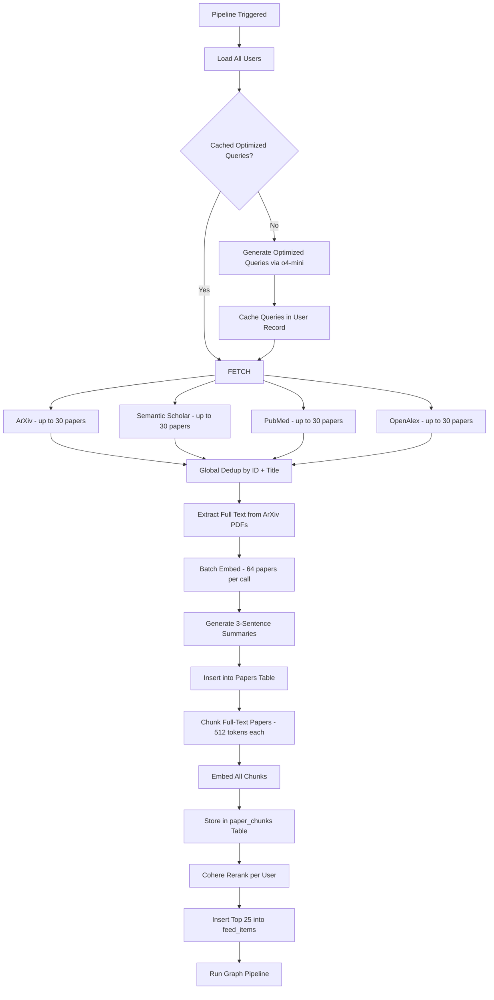
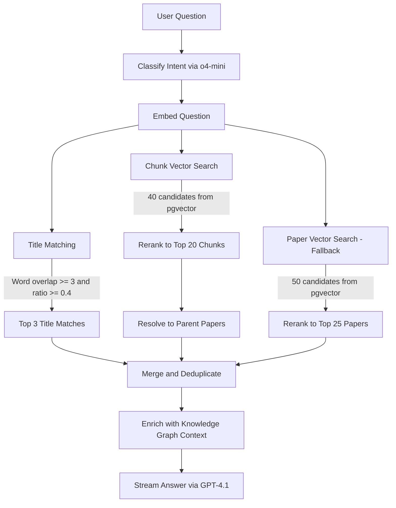
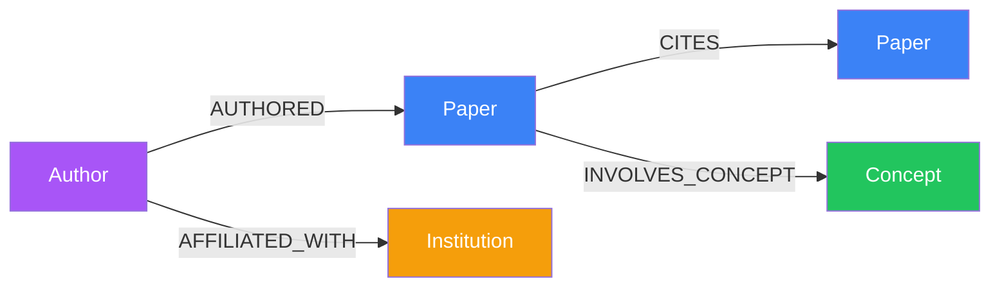
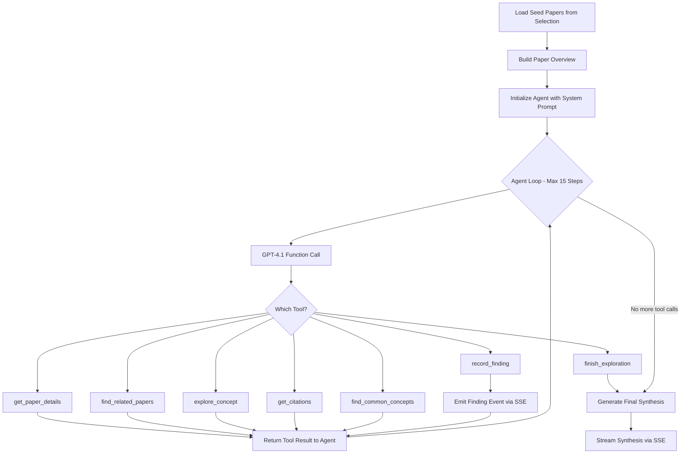
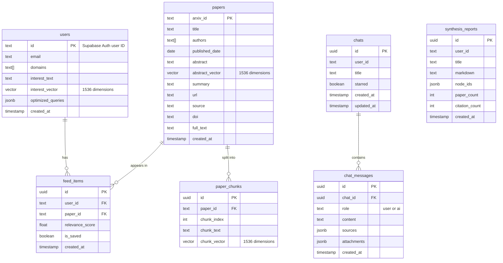

# PaperPulse

PaperPulse is a research digest. You describe what you work on, and every night it searches ArXiv,
Semantic Scholar, PubMed, and OpenAlex, ranks what turns up against your interests, and puts the
twenty-five most relevant papers in your feed. It summarizes each one, builds a graph of how the
papers connect to their authors, concepts, and citations, and answers questions using the full text
rather than just the abstracts.

Python and FastAPI on the backend, Next.js on the front, Postgres with pgvector for retrieval, and
Neo4j for the graph.

## Contents

- [Demo](#demo)
- [What it does](#what-it-does)
- [How it works](#how-it-works)
- [Architecture](#architecture)
- [System design](#system-design)
  - [Data ingestion pipeline](#data-ingestion-pipeline)
  - [Paper processing](#paper-processing)
  - [Retrieval and ranking](#retrieval-and-ranking)
  - [Knowledge graph](#knowledge-graph)
  - [Question answering](#question-answering)
  - [Agent-based graph traversal](#agent-based-graph-traversal)
- [Tech stack](#tech-stack)
- [Authentication and security](#authentication-and-security)
- [Deployment](#deployment)
- [Database schema](#database-schema)
- [API reference](#api-reference)
- [Frontend](#frontend)
- [Getting started](#getting-started)
- [Environment variables](#environment-variables)
- [Project structure](#project-structure)

---

## Demo

https://github.com/user-attachments/assets/210e88fc-17cb-4535-a9b2-9a7fb31ba108

**Feed**


<br/><br/>

**Ask AI**


<br/><br/>

**Knowledge graph**


<br/><br/>

**Onboarding**


<br/><br/>

**Saved papers**


<br/><br/>

**Literature review**


---

## What it does

**Daily feed.** Papers are fetched from four databases based on your domains and interests, ranked
against your profile with Cohere reranking. The top twenty-five appear grouped by date.

**Summaries.** Each paper gets a three-sentence summary covering the problem, the approach, and the
findings, written from the extracted full text.

**Questions with citations.** Ask about any paper or topic in your feed. Retrieval runs a hybrid
search across titles, chunks, and whole papers, adds knowledge graph context, and streams back an
answer with inline citations.

**File input.** Images, PDFs, Word documents, audio, and video can be attached to a question. Text
is extracted or the media is transcribed, then included in the context.

**Graph explorer.** A force-directed view of how papers, authors, concepts, and institutions relate.
Click a node for its connections, search the graph, filter by node or edge type, and see
automatically detected clusters.

**Literature synthesis.** Select papers in the graph and generate a review in one of three modes:

| Mode     | Output                                                          |
| -------- | --------------------------------------------------------------- |
| Quick    | Concise overview with a Mermaid citation diagram                |
| Academic | Multi-section review with BibTeX references                     |
| Deep     | Agent explores the graph iteratively, then writes the synthesis |

**Chat history.** Conversations are saved with their messages, attachments, and citations. Chats can
be starred, renamed, searched, and resumed.

---

## How it works

1. You sign up with Google, GitHub, or email, pick your domains, and describe your interests
2. Those interests are turned into focused search queries
3. Every night at midnight UTC, four academic databases are searched
4. Each paper is processed: PDF text extracted, embedding created, summary generated
5. Papers are ranked against your interests and the top twenty-five go into your feed
6. A knowledge graph is built linking papers to authors, concepts, institutions, and citations
7. When you ask something, the most relevant sections are retrieved, graph context is added, and an
   answer is generated with citations

---

## Architecture


```mermaid
graph TB
    subgraph Hosting
        VCL[Vercel]
        AR[AWS App Runner]
        ECR[AWS ECR]
    end

    subgraph Frontend
        LP[Landing Page]
        OB[Onboarding]
        FD[Paper Feed]
        SV[Saved Papers]
        AK[Ask AI Chat]
        GR[Graph Explorer]
    end

    subgraph Auth
        SA[Supabase Auth]
        GOA[Google OAuth]
        GHA2[GitHub OAuth]
    end

    subgraph Backend
        API[FastAPI Server]
        SCH[APScheduler - Midnight Cron]
        AUTHMW[JWT Auth Middleware]
    end

    subgraph Pipeline
        AX[ArXiv API]
        S2[Semantic Scholar API]
        PM[PubMed API]
        OA[OpenAlex API]
        PDF[PDF Extractor]
        EMB[Embedding Service]
        SUM[Summary Generator]
        CHK[Chunking Service]
        RR[Cohere Reranker]
        QO[Query Optimizer]
    end

    subgraph Models
        GPT[GPT-4.1 - Q&A and Synthesis]
        O4M[o4-mini - Summaries and Classification]
        EMM[text-embedding-3-large]
        WHI[Whisper - Audio Transcription]
        COH[rerank-v4.0-pro]
    end

    subgraph Storage
        SB[(Supabase - PostgreSQL + pgvector)]
        N4[(Neo4j - Knowledge Graph)]
    end

    subgraph Graph Pipeline
        EE[Entity Extraction]
        CF[Citation Fetcher]
        GP[Graph Population]
    end

    ECR --> AR
    VCL --> Frontend
    AR --> Backend

    GOA --> SA
    GHA2 --> SA
    SA --> AUTHMW
    Frontend --> AUTHMW
    AUTHMW --> API

    LP --> OB
    OB --> API
    FD --> API
    SV --> API
    AK --> API
    GR --> API

    SCH --> Pipeline
    API --> Pipeline

    AX --> PDF
    S2 --> Pipeline
    PM --> Pipeline
    OA --> Pipeline

    PDF --> EMB
    EMB --> SUM
    SUM --> CHK
    CHK --> RR

    Pipeline --> SB
    GP --> N4

    API --> GPT
    API --> O4M
    API --> EMM
    API --> COH

    QO --> O4M
    SUM --> O4M
    EMB --> EMM
    RR --> COH

    Pipeline --> GP
    GP --> EE
    GP --> CF
    EE --> O4M
    CF --> S2
```

---

## System design

### Data ingestion pipeline

The pipeline runs at midnight via APScheduler and can also be triggered manually. It processes
papers per user.


```mermaid
flowchart TD
    START[Pipeline Triggered] --> USERS[Load All Users]
    USERS --> QUERIES{Cached Optimized Queries?}
    QUERIES -- Yes --> FETCH
    QUERIES -- No --> OPTIMIZE[Generate Optimized Queries via o4-mini]
    OPTIMIZE --> CACHE[Cache Queries in User Record]
    CACHE --> FETCH

    FETCH --> AX[ArXiv - up to 30 papers]
    FETCH --> S2[Semantic Scholar - up to 30 papers]
    FETCH --> PM[PubMed - up to 30 papers]
    FETCH --> OA[OpenAlex - up to 30 papers]

    AX --> DEDUP[Global Dedup by ID + Title]
    S2 --> DEDUP
    PM --> DEDUP
    OA --> DEDUP

    DEDUP --> PDFTXT[Extract Full Text from ArXiv PDFs]
    PDFTXT --> EMBED[Batch Embed - 64 papers per call]
    EMBED --> SUMMARIZE[Generate 3-Sentence Summaries]
    SUMMARIZE --> STORE[Insert into Papers Table]
    STORE --> CHUNK[Chunk Full-Text Papers - 512 tokens each]
    CHUNK --> CHUNK_EMBED[Embed All Chunks]
    CHUNK_EMBED --> CHUNK_STORE[Store in paper_chunks Table]

    CHUNK_STORE --> RERANK[Cohere Rerank per User]
    RERANK --> FEED[Insert Top 25 into feed_items]
    FEED --> GRAPH[Run Graph Pipeline]
```

Query optimization runs once when a user onboards, then refreshes every 7 days. It takes the user's
free-text interests and selected domains and produces 3 to 5 focused search queries, 6 to 10
technical keywords, and 2 to 5 ArXiv sub-categories. These are cached in the user record with a
`generated_at` timestamp and reused on nightly runs until the refresh window expires.

The 7-day cycle only controls how often the search queries are regenerated. Fetching, embedding,
summarizing, and ranking happen every night.

Source details:

| Source           | API             | Rate Limit            | Batch Size         | Daily Lookback | Bootstrap Lookback |
| ---------------- | --------------- | --------------------- | ------------------ | -------------- | ------------------ |
| ArXiv            | Atom XML feed   | 3s between requests   | 100 per call       | 3 days         | 30 days            |
| Semantic Scholar | REST JSON       | 1s between requests   | 100 per call       | 3 days         | 30 days            |
| PubMed           | E-utilities XML | 0.35s with API key    | 50 per fetch batch | 7 days         | 30 days            |
| OpenAlex         | REST JSON       | 0.2s between requests | 50 per page        | 3 days         | 30 days            |

Before reranking, the pipeline reads each user's existing `feed_items` and drops papers they have
already been shown, so only new work enters the feed.

Deduplication prefers ArXiv versions when the same paper arrives from several sources. Papers are
matched by ArXiv ID first, then by normalized title similarity.

### Paper processing

Full-text extraction downloads the PDF from ArXiv and pulls text with PyMuPDF. The text is cleaned
by removing null bytes, collapsing whitespace, stripping page numbers, and fixing hyphenation
artifacts. Output is capped at 120,000 characters, roughly 30,000 tokens.

Embedding uses OpenAI text-embedding-3-large at 1536 dimensions, in batches of 64. The vector comes
from the abstract and is stored in a pgvector column.

Summarization uses o4-mini with reasoning effort set to low, for cost. Each paper gets three
sentences covering problem, approach, and findings.

Chunking splits full-text papers into overlapping segments for sub-document retrieval:

| Parameter              | Value       |
| ---------------------- | ----------- |
| Target chunk size      | 512 tokens  |
| Overlap between chunks | 50 tokens   |
| Minimum chunk size     | 50 tokens   |
| Tokenizer              | cl100k_base |

Chunking splits on paragraph boundaries first and falls back to sentences for oversized paragraphs.
Each chunk is prefixed with the paper title so the embedding model has document-level context.

### Retrieval and ranking

A question runs through a three-stage hybrid retrieval pipeline:


```mermaid
flowchart TD
    Q[User Question] --> CLASSIFY[Classify Intent via o4-mini]
    CLASSIFY --> EMB_Q[Embed Question]

    EMB_Q --> T[Title Matching]
    EMB_Q --> C[Chunk Vector Search]
    EMB_Q --> P[Paper Vector Search - Fallback]

    T --> |Word overlap >= 3 and ratio >= 0.4| TOP3[Top 3 Title Matches]
    C --> |40 candidates from pgvector| RERANK_C[Rerank to Top 20 Chunks]
    RERANK_C --> PAPERS_C[Resolve to Parent Papers]
    P --> |50 candidates from pgvector| RERANK_P[Rerank to Top 25 Papers]

    TOP3 --> MERGE[Merge and Deduplicate]
    PAPERS_C --> MERGE
    RERANK_P --> MERGE

    MERGE --> GRAPH[Enrich with Knowledge Graph Context]
    GRAPH --> LLM[Stream Answer via GPT-4.1]
```

Stage 1, title matching, compares the question word-for-word against every paper title in the user's
feed. A match needs at least 3 overlapping non-stop-words and a Jaccard ratio of 0.4 or higher. The
top 3 are returned.

Stage 2, chunk-level vector search, calls a Supabase RPC that runs cosine similarity across
`paper_chunks`. It returns 40 candidates, reranked by Cohere to the top 20, and the parent papers are
resolved from the matching chunks.

Stage 3, paper-level fallback, activates when chunk search returns fewer than 3 results. It searches
the papers table on abstract embeddings, returning 50 candidates reranked to the top 25.

Results from all three stages are merged with title matches taking priority, then deduplicated by
paper ID.

Graph enrichment fetches the neighborhood for every retrieved paper, including co-authors, related
concepts, citation links, and affiliations. That context is prepended to the prompt so the model can
refer to structural relationships.

Intent classification uses o4-mini to label the question as `retrieval` (needs paper lookup),
`follow_up` (continues from history), or `general` (needs no papers). This decides whether the full
retrieval pipeline runs.

### Knowledge graph

The graph lives in Neo4j and captures structural relationships between research entities.


```mermaid
graph LR
    P1[Paper] -->|CITES| P2[Paper]
    A1[Author] -->|AUTHORED| P1
    A1 -->|AFFILIATED_WITH| I1[Institution]
    P1 -->|INVOLVES_CONCEPT| C1[Concept]

    style P1 fill:#3b82f6,color:#fff
    style P2 fill:#3b82f6,color:#fff
    style A1 fill:#a855f7,color:#fff
    style C1 fill:#22c55e,color:#fff
    style I1 fill:#f59e0b,color:#fff
```

Nodes and properties:

| Node        | Properties                                   |
| ----------- | -------------------------------------------- |
| Paper       | arxiv_id, title, published_date, source, url |
| Author      | name, name_lower                             |
| Concept     | name, name_lower, category                   |
| Institution | name, name_lower                             |

Concept categories are method, dataset, theory, task, and technique.

Edges:

| Edge             | Meaning                         |
| ---------------- | ------------------------------- |
| CITES            | Paper A references Paper B      |
| AUTHORED         | Author wrote Paper              |
| INVOLVES_CONCEPT | Paper uses or discusses Concept |
| AFFILIATED_WITH  | Author belongs to Institution   |

Population runs in five steps:

1. Paper nodes are batch-upserted with MERGE on `arxiv_id`
2. Author relationships are created from paper metadata
3. Concepts are extracted by o4-mini from each title and abstract, 3 to 10 per paper
4. Citations come from the Semantic Scholar API for up to 30 papers per run
5. Institutions come from OpenAlex via DOI lookup for up to 20 papers per run

Cluster detection uses connected-component analysis. Two papers count as connected if they share 2
or more concepts or have a direct citation link. BFS finds the components and each cluster is
labeled by its three most frequent concepts.

Constraints and indexes:

- Uniqueness on `Paper.arxiv_id`, `Author.name_lower`, `Concept.name_lower`, `Institution.name_lower`
- Full-text indexes on `Paper.title` and `Concept.name`

### Question answering

Text-only and multimodal queries, streamed over SSE.

| Setting            | Value            |
| ------------------ | ---------------- |
| Model              | GPT-4.1          |
| Temperature        | 0.4              |
| Max output tokens  | 16,384           |
| Max context window | 32,000 tokens    |
| History window     | Last 10 messages |
| Message truncation | 3,000 characters |

The context budget is divided evenly across retrieved papers with a floor of 800 tokens each. A
paper whose full text exceeds its share is truncated at the token level by encoding, slicing, and
decoding. Papers left with fewer than 200 tokens after the title allocation are dropped.

File handling:

| Input type | Processing                                                     |
| ---------- | --------------------------------------------------------------- |
| Images     | Base64-encoded and sent to GPT-4.1 vision                      |
| PDFs       | Text extracted via PyMuPDF                                     |
| Word docs  | Text extracted via python-docx                                 |
| Audio      | Transcribed via Whisper                                        |
| Video      | Audio track extracted via ffmpeg, then transcribed via Whisper |
| Text files | Read directly as UTF-8                                         |

Maximum upload size is 25 MB.

The stream sends five event types:

| Event   | Payload                          | Timing                    |
| ------- | -------------------------------- | ------------------------- |
| stage   | Current processing step name     | As each stage starts      |
| sources | Retrieved paper metadata         | After retrieval completes |
| token   | Single token of the response     | During generation         |
| done    | Final complete response text     | After generation finishes |
| error   | Error message                    | On failure                |

### Agent-based graph traversal

Deep mode runs an agent that walks the knowledge graph looking for themes, gaps, and connections
before writing the synthesis.


```mermaid
flowchart TD
    SEED[Load Seed Papers from Selection] --> OVERVIEW[Build Paper Overview]
    OVERVIEW --> INIT[Initialize Agent with System Prompt]
    INIT --> LOOP{Agent Loop - Max 15 Steps}

    LOOP --> CALL[GPT-4.1 Function Call]
    CALL --> TOOL{Which Tool?}

    TOOL --> T1[get_paper_details]
    TOOL --> T2[find_related_papers]
    TOOL --> T3[explore_concept]
    TOOL --> T4[get_citations]
    TOOL --> T5[find_common_concepts]
    TOOL --> T6[record_finding]
    TOOL --> T7[finish_exploration]

    T1 --> RESULT[Return Tool Result to Agent]
    T2 --> RESULT
    T3 --> RESULT
    T4 --> RESULT
    T5 --> RESULT
    T6 --> FINDING[Emit Finding Event via SSE]
    FINDING --> RESULT
    T7 --> SYNTH

    RESULT --> LOOP

    LOOP -- No more tool calls --> SYNTH[Generate Final Synthesis]
    SYNTH --> STREAM[Stream Synthesis via SSE]
```

The agent has seven tools against Neo4j. It starts from the selected papers and works outward
through citations, related papers, and shared concepts, recording findings as it goes. Each finding
is categorized as a theme, gap, method, trend, connection, or contradiction.

It runs at temperature 0.2 for tool-calling decisions and switches to 0.3 with a 6,144 token budget
for the final synthesis.

---

## Tech stack

### Backend

| Technology          | Role                                  |
| ------------------- | ------------------------------------- |
| Python 3.11+        | Runtime                               |
| FastAPI             | REST API framework                    |
| Uvicorn             | ASGI server                           |
| APScheduler         | Scheduled pipeline execution          |
| Pydantic            | Request and response validation       |
| Supabase Python SDK | PostgreSQL and pgvector client        |
| Neo4j Python Driver | Knowledge graph client                |
| OpenAI Python SDK   | GPT-4.1, o4-mini, embeddings, Whisper |
| Cohere Python SDK   | Neural reranking                      |
| PyMuPDF             | PDF text extraction                   |
| python-docx         | Word document parsing                 |
| tiktoken            | Token counting                        |
| httpx               | Async HTTP client                     |
| python-dotenv       | Environment configuration             |
| tenacity            | Retry logic for API calls             |

### Frontend

| Technology                   | Role                               |
| ---------------------------- | ---------------------------------- |
| Next.js 16                   | React framework with App Router    |
| React 19                     | UI library                         |
| TypeScript 5                 | Type safety                        |
| Tailwind CSS 4               | Utility-first styling              |
| shadcn/ui                    | Reusable UI components             |
| next-themes                  | Light and dark theme switching     |
| Supabase Auth                | Authentication and user management |
| react-force-graph-2d         | Force-directed graph visualization |
| react-markdown               | Markdown rendering                 |
| rehype-katex and remark-math | LaTeX math rendering               |
| Mermaid                      | Diagram generation                 |
| Lucide React                 | Icon library                       |

### Infrastructure

| Technology     | Role                                        |
| -------------- | ------------------------------------------- |
| AWS App Runner | Managed backend hosting                     |
| AWS ECR        | Docker container registry                   |
| Vercel         | Frontend hosting and edge network           |
| Docker         | Backend containerization                    |
| Supabase       | Managed PostgreSQL with pgvector extension  |
| Neo4j Aura     | Managed graph database                      |
| Supabase Auth  | Authentication with Google and GitHub OAuth |

### Models

| Model                  | Provider | Purpose                                                                                    |
| ---------------------- | -------- | ------------------------------------------------------------------------------------------ |
| GPT-4.1                | OpenAI   | Q&A answers, vision, literature synthesis, publication reviews, agent traversal            |
| o4-mini                | OpenAI   | Paper summaries, intent classification, chat titles, entity extraction, query optimization |
| text-embedding-3-large | OpenAI   | 1536-dimension vector embeddings for papers, chunks, and user interests                    |
| Whisper                | OpenAI   | Audio and video transcription                                                              |
| rerank-v4.0-pro        | Cohere   | Neural reranking with 32K token context per document                                       |

---

## Authentication and security

Every backend route is behind JWT auth via Supabase.

- `get_current_user()` reads the `Authorization: Bearer <token>` header, verifies the JWT with
  Supabase, and returns the user. Applied as a dependency on all routers.
- `require_same_user()` keeps a user to their own data (feed, chats, reports). Used on user-scoped
  endpoints.
- `require_admin()` gates admin endpoints (pipeline trigger, graph population) behind an
  `X-Admin-Key` header. If `ADMIN_API_KEY` is unset, those endpoints are open, which is dev mode.

On the frontend:

- `authFetch()` in [lib/api.ts](frontend/lib/api.ts) wraps `fetch()` and attaches the Supabase
  session JWT to every API call.
- [proxy.ts](frontend/proxy.ts) is the Next.js middleware proxy that calls `updateSession()` on
  every request to refresh the session cookie.
- Protected pages (`/feed`, `/saved`, `/ask`, `/graph`, `/onboarding`) check `useAuth()` and redirect
  signed-out visitors to the landing page.
- [app/auth/callback/route.ts](frontend/app/auth/callback/route.ts) handles the OAuth redirect after
  Google or GitHub sign-in and exchanges the code for a session.

| Provider | Scopes         |
| -------- | -------------- |
| Google   | email, profile |
| GitHub   | user:email     |

Email and password sign-up works as a fallback.

---

## Deployment

```
┌──────────────┐                              ┌──────────────────┐
│   Vercel     │                              │  AWS App Runner  │
│  (Frontend)  │─────────── API calls ───────>│   (Backend)      │
└──────────────┘                              └──────────────────┘
       │                                               │
       v                                               v
┌──────────────┐                              ┌──────────────────┐
│ Supabase Auth│                              │  Supabase DB     │
│ (OAuth +     │                              │  (PostgreSQL +   │
│  sessions)   │                              │   pgvector)      │
└──────────────┘                              └──────────────────┘
                                                       │
                                                       v
                                              ┌──────────────────┐
                                              │   Neo4j Aura     │
                                              │ (Knowledge Graph)│
                                              └──────────────────┘
```

The backend ships as a Docker image built from `backend/Dockerfile` and currently runs on AWS App
Runner, pulling from ECR (`paper-pulse-api`). The repository has no CI workflow at the moment, so
the image is built and pushed outside of it. [MIGRATION.md](MIGRATION.md) covers moving the backend
off App Runner onto self-hosting.

The frontend is connected to Vercel and auto-deploys on pushes to `main`, with environment variables
set in the Vercel dashboard.

Supabase provides managed Postgres with the pgvector extension. Neo4j Aura provides the graph, with
retry logic on the client (3 attempts, exponential backoff) for transient connection failures.

For auth, configure the Google and GitHub providers in the Supabase dashboard and set the redirect
URL to `https://<your-frontend-domain>/auth/callback`.

---

## Database schema

### Supabase tables


```mermaid
erDiagram
    users {
        text id PK "Supabase Auth user ID"
        text email
        text[] domains
        text interest_text
        vector interest_vector "1536 dimensions"
        jsonb optimized_queries
        timestamp created_at
    }

    papers {
        text arxiv_id PK
        text title
        text[] authors
        date published_date
        text abstract
        vector abstract_vector "1536 dimensions"
        text summary
        text url
        text source
        text doi
        text full_text
        timestamp created_at
    }

    paper_chunks {
        uuid id PK
        text paper_id FK
        int chunk_index
        text chunk_text
        vector chunk_vector "1536 dimensions"
    }

    feed_items {
        uuid id PK
        text user_id FK
        text paper_id FK
        float relevance_score
        boolean is_saved
        timestamp created_at
    }

    chats {
        uuid id PK
        text user_id
        text title
        boolean starred
        timestamp created_at
        timestamp updated_at
    }

    chat_messages {
        uuid id PK
        uuid chat_id FK
        text role "user or ai"
        text content
        jsonb sources
        jsonb attachments
        timestamp created_at
    }

    synthesis_reports {
        uuid id PK
        text user_id
        text title
        text markdown
        jsonb node_ids
        int paper_count
        int citation_count
        timestamp created_at
    }

    users ||--o{ feed_items : "has"
    papers ||--o{ feed_items : "appears in"
    papers ||--o{ paper_chunks : "split into"
    chats ||--o{ chat_messages : "contains"
```

### Supabase RPC functions

| Function           | Purpose                                                                   |
| ------------------ | ------------------------------------------------------------------------- |
| match_paper_chunks | Cosine similarity search on chunk vectors, filtered by user feed          |
| match_user_papers  | Cosine similarity search on paper abstract vectors, filtered by user feed |

### Neo4j schema

| Constraint             | Target |
| ---------------------- | ------ |
| Paper.arxiv_id         | Unique |
| Author.name_lower      | Unique |
| Concept.name_lower     | Unique |
| Institution.name_lower | Unique |

| Full-text index | Field        |
| --------------- | ------------ |
| paper_title_ft  | Paper.title  |
| concept_name_ft | Concept.name |

---

## API reference

All endpoints need a valid `Authorization: Bearer <token>` header from Supabase Auth unless noted.

### Users

| Method | Path             | Description                                                         |
| ------ | ---------------- | ------------------------------------------------------------------- |
| POST   | /users/          | Create user from onboarding with domain selection and interest text |
| GET    | /users/{user_id} | Get user profile                                                    |

### Feed

| Method | Path                  | Description                                        |
| ------ | --------------------- | -------------------------------------------------- |
| GET    | /feed/{user_id}       | Get daily paper feed ordered by date and relevance |
| GET    | /feed/{user_id}/saved | Get saved papers                                   |
| PATCH  | /feed/{feed_item_id}  | Toggle save status                                 |

### Papers

| Method | Path               | Description                                |
| ------ | ------------------ | ------------------------------------------ |
| GET    | /papers/{arxiv_id} | Get full paper metadata, summary, and text |

### Ask

| Method | Path                   | Description                             |
| ------ | ---------------------- | --------------------------------------- |
| POST   | /ask/                  | Text-only Q&A with conversation history |
| POST   | /ask/multimodal        | Q&A with file uploads                   |
| POST   | /ask/stream            | SSE streaming text-only Q&A             |
| POST   | /ask/stream/multimodal | SSE streaming multimodal Q&A            |

### Chats

| Method | Path                      | Description                                      |
| ------ | ------------------------- | ------------------------------------------------ |
| GET    | /chats/                   | List all chats sorted by starred then updated    |
| GET    | /chats/search             | Full-text search across chat titles and messages |
| POST   | /chats/                   | Create new chat                                  |
| GET    | /chats/{chat_id}          | Get chat with all messages                       |
| PATCH  | /chats/{chat_id}          | Update title or starred status                   |
| DELETE | /chats/{chat_id}          | Delete chat and all messages                     |
| POST   | /chats/{chat_id}/messages | Save a message with auto-title generation        |

### Knowledge graph

| Method | Path                              | Description                                       |
| ------ | --------------------------------- | ------------------------------------------------- |
| GET    | /graph/explore                    | Full graph data for the explorer                  |
| GET    | /graph/stats                      | Node and edge counts                              |
| GET    | /graph/search                     | Full-text search across papers, authors, concepts |
| GET    | /graph/clusters                   | Auto-detected paper clusters                      |
| GET    | /graph/paper/{arxiv_id}           | Paper neighborhood                                |
| GET    | /graph/paper/{arxiv_id}/related   | Related papers by shared concepts and citations   |
| GET    | /graph/paper/{arxiv_id}/citations | Citation network up to 3 hops                     |
| GET    | /graph/author/{name}              | Co-author network                                 |
| GET    | /graph/concept/{name}             | Papers involving a concept                        |
| GET    | /graph/node/{node_id}             | Node detail with neighborhood                     |
| POST   | /graph/synthesize                 | Quick literature review with Mermaid diagram      |
| POST   | /graph/synthesize-publication     | Publication-ready review with BibTeX              |
| POST   | /graph/agent-synthesize           | SSE-streamed agent traversal and synthesis        |
| GET    | /graph/reports                    | List saved reports                                |
| POST   | /graph/reports                    | Save a report                                     |
| DELETE | /graph/reports/{report_id}        | Delete a report                                   |
| POST   | /graph/populate                   | Trigger graph population                          |
| GET    | /graph/populate/status            | Check graph population status                     |

### Pipeline

| Method | Path                | Description                                           |
| ------ | ------------------- | ----------------------------------------------------- |
| POST   | /pipeline/run       | Manually trigger the daily pipeline (admin only)      |
| GET    | /pipeline/status    | Check pipeline running status (admin only)            |
| POST   | /pipeline/bootstrap | Run bootstrap pipeline for a single user (admin only) |

---

## Frontend

| Page                   | What it is                                                                                                           |
| ---------------------- | -------------------------------------------------------------------------------------------------------------------- |
| `/`                    | Hero, call-to-action buttons, four feature cards, and the source badges                                              |
| `/onboarding`          | 28 research domains in five groups, plus a free-text interests field                                                 |
| `/feed`                | Date-grouped paper cards with a jump-to-date rail, tracked by IntersectionObserver                                   |
| `/saved`               | Bookmarked papers with client-side search                                                                            |
| `/ask`                 | Chat with a conversation sidebar, file attachments, voice recording, SSE streaming, KaTeX and GFM markdown           |
| `/graph`               | Force-directed explorer with filtering, search, clustering, three synthesis modes, Mermaid rendering, and PNG export |
| `/sign-in`, `/sign-up` | Email and password forms plus Google and GitHub OAuth                                                                |
| `/unauthorized`, 404, error boundary | Status pages sharing the app logo and layout                                                           |

All signed-in pages share a `Navbar` (logo, Feed / Saved / Ask AI / Graph, theme toggle, avatar
menu), which collapses to a hamburger on mobile. It takes `leftContent` and `rightContent` slots,
used by `/ask` for its sidebar toggle and by `/graph` for its search bar.

Branding is indigo-accented: a custom SVG logo (rounded document with a pulse line) doubles as the
favicon, and the wordmark renders "Paper" in dark text and "Pulse" in indigo. Light theme is the
default, dark is a toggle in the navbar, and `next-themes` persists the choice in localStorage
without a flash of unstyled content. Graph nodes are colored by type: papers blue, authors purple,
concepts green, institutions amber.

`/graph` deep-links via `?paper=<arxiv_id>`, which is what the "View in Graph" button on a paper
card sends. The graph waits for the force simulation to settle before centering and zooming the
target node, which avoids the camera chasing nodes that are still moving.

`PageLoader` and `RedirectLoader` cover auth checks and transitions so pages do not flash blank.

---

## Getting started

You need Python 3.11+, Node 18+, a Supabase project with pgvector enabled, a Neo4j instance (Aura or
local), and API keys for OpenAI and Cohere.

Backend:

```bash
cd backend
python -m venv venv
source venv/bin/activate
pip install -r requirements.txt
cp .env.example .env
# edit .env with your credentials
python run.py
```

The API comes up on http://localhost:8000.

Frontend:

```bash
cd frontend
npm install
cp .env.example .env.local
# edit .env.local with your Supabase URL and anon key
npm run dev
```

The app comes up on http://localhost:3000.

---

## Environment variables

### Backend

| Variable                 | Required | Description                                              |
| ------------------------ | -------- | -------------------------------------------------------- |
| OPENAI_API_KEY           | Yes      | OpenAI API key for GPT-4.1, o4-mini, embeddings, Whisper |
| COHERE_API_KEY           | Yes      | Cohere API key for rerank-v4.0-pro                       |
| SUPABASE_URL             | Yes      | Supabase project URL                                     |
| SUPABASE_KEY             | Yes      | Supabase service role key                                |
| NEO4J_URI                | Yes      | Neo4j connection URI                                     |
| NEO4J_USERNAME           | Yes      | Neo4j username                                           |
| NEO4J_PASSWORD           | Yes      | Neo4j password                                           |
| CORS_ORIGIN              | No       | Frontend origin URL, defaults to http://localhost:3000   |
| SEMANTIC_SCHOLAR_API_KEY | No       | Semantic Scholar API key for higher rate limits          |
| NCBI_API_KEY             | No       | PubMed API key for higher rate limits                    |
| OPENALEX_MAILTO          | No       | Email for OpenAlex polite pool                           |
| ADMIN_API_KEY            | Prod     | Shared secret for admin-only endpoints                   |

### Frontend

| Variable                      | Required | Description                                        |
| ----------------------------- | -------- | -------------------------------------------------- |
| NEXT_PUBLIC_SUPABASE_URL      | Yes      | Supabase project URL                               |
| NEXT_PUBLIC_SUPABASE_ANON_KEY | Yes      | Supabase anonymous (public) key                    |
| NEXT_PUBLIC_API_URL           | Yes      | Backend API URL, defaults to http://localhost:8000 |

---

## Project structure

```
paper-pulse/
    backend/
        run.py                              Server entry point
        requirements.txt                    Python dependencies
        Dockerfile                          Container build
        app/
            main.py                         FastAPI app with lifespan and scheduler
            database.py                     Supabase client initialization
            models.py                       Pydantic request and response models
            auth.py                         JWT auth, ownership checks, admin gate
            routers/
                users.py                    User registration and profiles
                feed.py                     Paper feed and bookmarks
                papers.py                   Single paper lookup
                ask.py                      Q&A with hybrid retrieval and SSE streaming
                chats.py                    Chat CRUD and message persistence
                graph.py                    Knowledge graph queries and synthesis
                pipeline.py                 Manual pipeline trigger and bootstrap
            services/
                openai_service.py           GPT-4.1, o4-mini, embeddings, Whisper calls
                pipeline_service.py         Daily ingestion pipeline orchestration
                neo4j_service.py            Neo4j driver, schema, queries, clustering
                agent_service.py            Graph traversal agent
                graph_pipeline_service.py   Graph population from paper data
                arxiv_service.py            ArXiv API integration
                semantic_scholar_service.py Semantic Scholar API integration
                pubmed_service.py           PubMed E-utilities API integration
                openalex_service.py         OpenAlex API integration
                citation_service.py         Citation fetching from S2 and OpenAlex
                chunking_service.py         Paper text chunking for vector search
                pdf_service.py              PDF download and text extraction
                rerank_service.py           Cohere neural reranking
                query_optimizer.py          Search query optimization
                entity_extraction_service.py Concept and affiliation extraction
                file_processor.py           Attachment processing
    frontend/
        package.json                        Node dependencies
        next.config.ts                      Next.js configuration
        proxy.ts                            Supabase session refresh middleware
        app/
            layout.tsx                      Root layout with ThemeProvider and AuthProvider
            page.tsx                        Landing page
            globals.css                     Global styles and theme transitions
            auth/
                callback/route.ts           OAuth callback handler
            error.tsx                       Runtime error boundary
            not-found.tsx                   Custom 404 page
            onboarding/page.tsx             Domain selection and interest input
            feed/page.tsx                   Daily paper feed with date grouping
            saved/page.tsx                  Saved papers view
            ask/page.tsx                    Ask AI chat interface
            graph/page.tsx                  Knowledge graph explorer
            unauthorized/page.tsx           Access denied page
            sign-in/page.tsx                Email and password sign-in
            sign-up/page.tsx                Email and password sign-up
        components/
            RelatedPapers.tsx               Related paper suggestions
            mermaid-renderer.tsx            Mermaid diagram renderer
            auth-provider.tsx               Supabase Auth context and useAuth hook
            theme-provider.tsx              next-themes wrapper for light and dark mode
            navbar.tsx                      Shared navigation bar with theme toggle
            logo.tsx                        SVG logo icon and brand wordmark
            user-menu.tsx                   User avatar dropdown with sign-out
            page-loader.tsx                 PageLoader, RedirectLoader, and useAuthGuard
            ui/                             shadcn/ui primitives
        utils/
            supabase/
                client.ts                   Browser Supabase client
                server.ts                   Server-side Supabase client
                middleware.ts               Session refresh middleware helper
        lib/
            api.ts                          authFetch wrapper with JWT injection
            utils.ts                        Tailwind class merge utility
```
